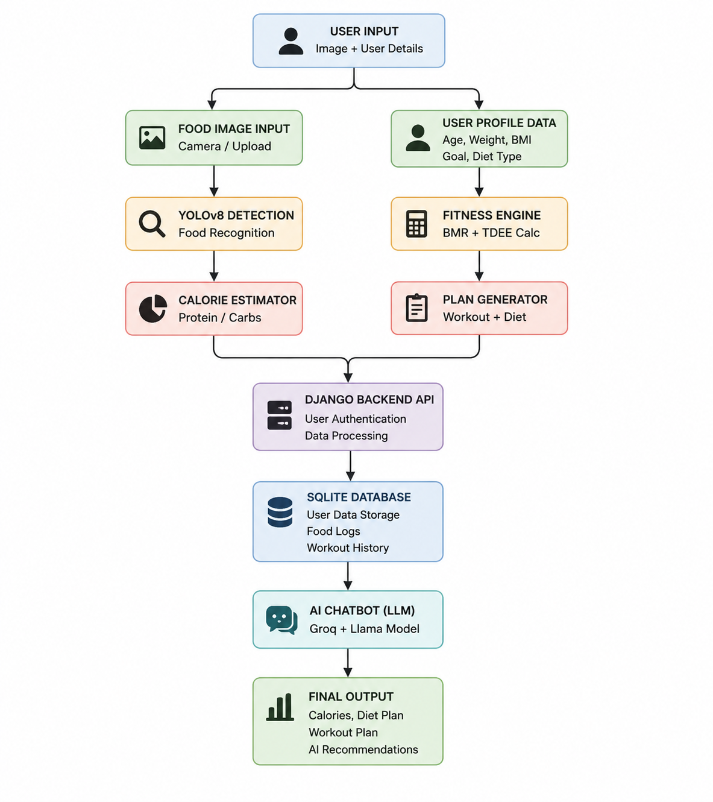

# 🏋️ Fit-AI: AI-Powered Fitness & Health Tracking System

Fit-AI is an AI-powered fitness and health tracking platform developed using Django, Python, and Machine Learning. The system helps users track their fitness activities, detect food items using computer vision, receive personalized diet and workout recommendations, and interact with an AI-powered health assistant.

---

##  Features

- 👤 User Authentication and Profile Management
- 🍎 AI-Based Food Detection using YOLO
- 🥗 Personalized Diet Recommendations
- 💪 Customized Workout Plans
- 🤖 AI Health & Fitness Chatbot
- 📊 Fitness Progress Tracking Dashboard
- 📈 Health Monitoring and Insights

---

## Technologies Used

- Python
- Django
- HTML
- CSS
- Bootstrap
- JavaScript
- YOLO Object Detection
- Machine Learning
- SQLite

---

##  System Architecture

## Project Modules

### Food Detection Module
Detects food items from images using a trained YOLO model.

### Diet Recommendation Module
Generates personalized diet suggestions based on user goals.

### Workout Recommendation Module
Provides customized workout plans for fitness improvement.

### AI Chatbot Module
Answers health and fitness-related queries using AI.

### Fitness Tracker
Tracks daily activities and user progress.

---

⭐ If you like this project, consider giving it a star on GitHub.
